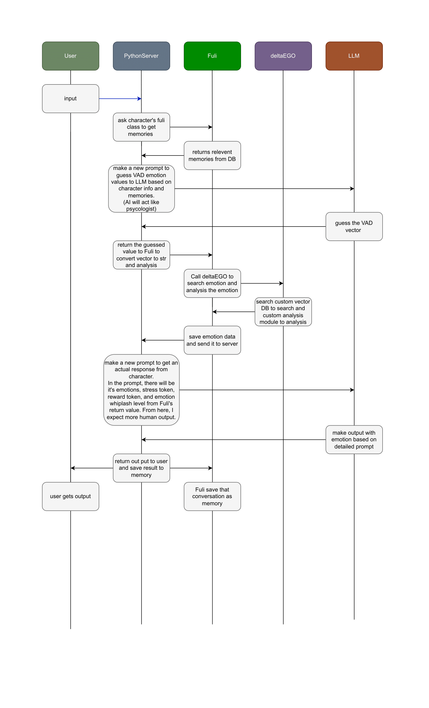
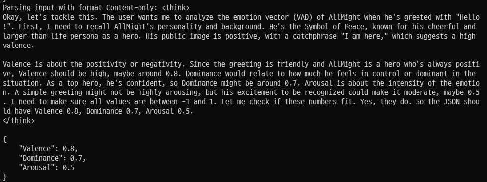

# Fuli – Emotion-aware memory orchestrator

Fuli is the **agent-side brain** that connects:

- user input,
- semantic memories (FAISS + SentenceTransformer),
- the emotion engine (`deltaEGO`),
- and the LLM.

It currently uses a **vector-based RAG 1.0** architecture  
(FAISS semantic search over past conversations),
and is designed to be upgraded to **RAG 2.0 (graph-based)** in future work.

Fuli does 3 main things:

1. Receives a VAD vector from the LLM and runs **deltaEGO** (search + analysis)  
2. Decides how “impressive” the current turn is and updates memories  
3. Retrieves relevant memories asynchronously and returns them as text context

---

## 🧩 System overview: Fuli + deltaEGO (RAG 1.0)

Fuli is the emotion-aware **memory orchestrator** in a RAG 1.0 setup:

- It retrieves relevant memories (FAISS vector search).
- It asks the LLM to **infer a VAD vector** (Valence–Arousal–Dominance).
- It calls `deltaEGO` to search a custom VAD vector DB and analyze emotion.
- It builds a final prompt with:
  - character info,
  - retrieved memories,
  - emotion labels,
  - stress / reward tokens,
  - whiplash (affective lability),
  and then gets the final character response.

### High-level pipeline



Rough flow:

1. **User → Fuli** – user sends an input message  
2. **Fuli → Memory** – retrieve recent & impressive memories (RAG 1.0, FAISS)  
3. **Fuli → LLM (VAD mode)** – ask LLM to act as a “psychologist” and output VAD  
4. **LLM → Fuli (VAD JSON)** – reasoning in `<think>...</think>`, then JSON VAD  
5. **Fuli → deltaEGO** – VADsearch (KD-tree) + analize_VAD (metrics)  
6. **Fuli → LLM (character mode)** – build emotion-aware prompt and get reply  
7. **LLM → User & Memory** – send reply, log VAD/search/analysis into memory  

This is the current **RAG 1.0 layer**: vector-based retrieval with FAISS,
emotion-aware scoring with deltaEGO, and a two-stage LLM pipeline.

---

## 🔧 Initialization

```python
from PythonServer.customPY.fuli import Fuli   # adjust path if needed

agent = Fuli(
    name="AllMight",
    short_mem_length=8,       # in-RAM queue (last N turns)
    recent_mem_length=32,     # FAISS recent memory capacity
    impressive_mem_length=32, # FAISS impressive memory capacity
    longterm_mem_length=0,    # (currently unused / TODO)
    background_length=0,      # (currently unused / TODO)
    emotion_load_num=5        # how many top emotions to store per turn
)
```
On initialization, Fuli:
  * loads existing FAISS indexes + JSON “general DB” from `CharacterSave/<name>/Memories/...`
  * creates empty indexes if files are missing
  * prepares a `deltaEGO` instance (`self.Carman`) and VAD config (`self.Ayin`)
---
## 🧠 VAD configuration (`Sephirah`, `Hod`, `Yesod`)
Fuli wraps VAD search/analysis configs into small dataclasses:
```python
@dataclass
class Hod:
    # search config for deltaEGO_VDB
    k: int = 5
    d: float | None = 0.3
    SIGMA: float = 0.6
    opt: str = "knn~gauss_w -B"

@dataclass
class Yesod:
    # analysis config for deltaEGO
    weights: weight = field(default_factory=lambda: copy.deepcopy(DEFAULT_WEIGHTS))
    var: variable = field(default_factory=lambda: copy.deepcopy(DEFAULT_VAR))
    ego_axis: EGO_axis = field(default_factory=lambda: copy.deepcopy(DEFAULT_EGO_AXIS))

@dataclass
class Sephirah:
    search_config: Hod = field(default_factory=Hod)
    analysis_config: Yesod = field(default_factory=Yesod)
```
Fuli keeps one instance:
```python
self.Ayin: Sephirah = Sephirah()
```
---
## 🧱 Memory system
**1) Short-term queue (`memory_queue`)**
```python
self.last_n_mem = memory_queue(short_mem_length)
```
  * Keeps the **last N conversations in RAM**.
  * Implemented as a `deque` with `maxlen`.
  * `add_memory()` returns the oldest item when it overflows:
    * Fuli then sends that popped memory into FAISS (recent / impressive DB).
      
**2) Vector DBs (FAISS)**
Fuli uses four logical memory types (two are currently active):
  * `recent_mem` (active)
  * `impressive_mem` (active)
  * `long_term_mem` (TODO)
  * `background` (TODO)

Each has:
  * a FAISS `IndexIDMap` (`*_mem_vec`)
  * a list of Pydantic models (`*_mem_gen`)

On startup:
```python
self.load_all_db()
```
loads or creates:
  * `.../recent_<name>_VDB.index` + `recent_<name>_GDB.json`
  * `../impressive_<name>_VDB.index` + `impressive_<name>_GDB.json`
  * (long-term/background are prepared but commented out for now)
    
All saves are done atomically with temp files to **be safe under multithreading**.
---
## 🩺 Step 1 – `get_emotion(...)`: running deltaEGO
```python
def get_emotion(self, VAD_str: str) -> bool:
    # 1) parse JSON from LLM
    #    {"Valence": float, "Arousal": float, "Dominance": float}
    # 2) validate range [-1, 1]
    # 3) run deltaEGO VAD search + analysis
    # 4) store simple emotions & state tokens
```
Typical call:
```python
ok = agent.get_emotion(vad_json_from_llm)
if not ok:
    # handle parse error or out-of-range VAD
    ...
```
**LLM response example*


Flow inside:
1. Parse JSON → `V`, `A`, `D`
2. Validate `-1.0 <= V, A, D <= 1.0`
3. Call `self.Carman.VADsearch(...)` with `self.Ayin.search_config`
4. Call `self.Carman.analize_VAD(...)` with `self.Ayin.analysis_config`
5. Extract:
    * `self.simple_emotion_result` = top-N emotion labels
    * `self.simple_emotion_analysis_token` = tokens(stress, reward, shocking_level)
    * `self.Abnomality = True` (guard flag: “emotion computed”)
---
## 🧩 Step 2 – `update_memory(...)`: logging the conversation
Usage pattern: always call `get_emotion()` first, then `update_memory()`.
```python
def update_memory(self, conversation: Conversation) -> None:
    if not self.Abnomality:
        raise Exception("Emotion is not searched! ...")
    ...
```
Inside:

1. Build the current `VADModel` from `self.VAD_search_result['query']`
2. Compute `impressiveness` (0–100) from VAD magnitude
3. Create new `general_mem` with:
    * emotion labels (`self.simple_emotion_result`)
    * state tokens (`self.simple_emotion_analysis_token`)
    * time stamp
    * raw `Conversation`
4. Push into `last_n_mem`; if an item is popped, send it to FAISS via `add_conv_as_memory`
5. Pack deltaEGO metrics into `analysis_dict`
6. Create a `Fuli_LOG` entry and append to `self.LOG`
7. Reset VAD-related state (`Abnomality = False`, etc.)
